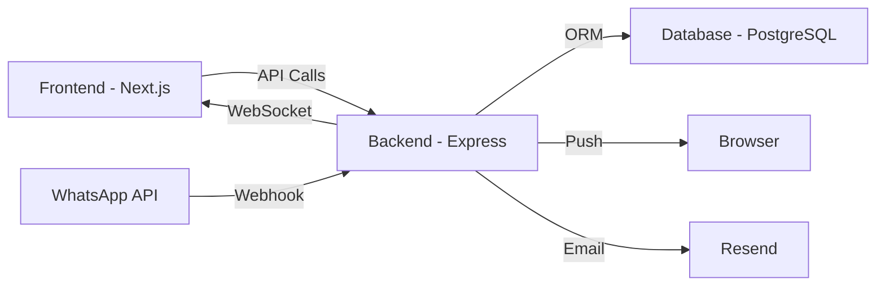

## Deployment Architecture

WhatsApp Team Inbox consists of three main components that need to be deployed:



## Components

<CardGroup cols={3}>
  <Card title="Frontend" icon="react">
    Next.js 14 application served via Vercel, Netlify, or self-hosted
  </Card>
  <Card title="Backend" icon="server">
    Express.js API server on Railway, Heroku, or VPS
  </Card>
  <Card title="Database" icon="database">
    PostgreSQL database on Railway, AWS RDS, or managed service
  </Card>
</CardGroup>

## Deployment Options

### Option 1: Fully Managed (Recommended)

<Steps>
  <Step title="Frontend on Vercel">
    - Zero configuration deployment
    - Automatic HTTPS
    - Global CDN
    - **Cost:** Free tier available
  </Step>

  <Step title="Backend on Railway">
    - Easy deployment from GitHub
    - Automatic scaling
    - Built-in PostgreSQL
    - **Cost:** ~$5-25/month
  </Step>

  <Step title="Database on Railway">
    - Managed PostgreSQL
    - Automatic backups
    - Connection pooling
    - **Included with backend**
  </Step>
</Steps>

### Option 2: Cloud Provider (AWS/GCP/Azure)

<Steps>
  <Step title="Frontend">
    - AWS Amplify / Google Cloud Run / Azure Static Web Apps
    - Full control over configuration
    - **Cost:** Pay-as-you-go
  </Step>

  <Step title="Backend">
    - AWS ECS / Google Cloud Run / Azure Container Apps
    - Container-based deployment
    - **Cost:** ~$20-100/month
  </Step>

  <Step title="Database">
    - AWS RDS / Cloud SQL / Azure Database
    - Fully managed
    - **Cost:** ~$15-50/month
  </Step>
</Steps>

### Option 3: Self-Hosted (VPS)

<Steps>
  <Step title="VPS Provider">
    DigitalOcean, Linode, or Vultr
    - Full control
    - **Cost:** ~$10-40/month
  </Step>

  <Step title="Setup">
    - Install Node.js, PostgreSQL, Nginx
    - Configure reverse proxy
    - Setup SSL with Let's Encrypt
  </Step>
</Steps>

## Pre-Deployment Checklist

<Check>Database created and accessible</Check>
<Check>Environment variables configured</Check>
<Check>WhatsApp Business API account created</Check>
<Check>Email service (Resend) account created</Check>
<Check>Domain name registered</Check>
<Check>SSL certificate obtained</Check>
<Check>DNS configured</Check>
<Check>Webhook URLs ready</Check>

## External Services Required

<CardGroup cols={2}>
  <Card title="WhatsApp Business API" icon="whatsapp" href="/deployment/whatsapp-setup">
    - Free test mode (5 conversations/day)
    - Production: Pay per conversation
    - **Setup time:** ~1 hour
  </Card>

  <Card title="Email Service (Resend)" icon="envelope" href="/deployment/email-setup">
    - 3,000 emails/month free
    - Domain verification required
    - **Setup time:** ~30 minutes
  </Card>

  <Card title="Database (PostgreSQL)" icon="database" href="/deployment/database-setup">
    - Railway: $5/month
    - AWS RDS: ~$15/month
    - **Setup time:** ~15 minutes
  </Card>

  <Card title="Push Notifications" icon="bell" href="/guides/push-notifications">
    - Free (using Web Push API)
    - VAPID keys required
    - **Setup time:** ~5 minutes
  </Card>
</CardGroup>

## Environment Variables

You'll need to configure these for production:

<AccordionGroup>
  <Accordion title="Backend Environment Variables" icon="server">
    ```bash
    # Application
    NODE_ENV=production
    PORT=4000
    FRONTEND_URL=https://your-domain.com

    # Database
    DATABASE_URL=postgresql://...

    # Authentication
    JWT_SECRET=...
    SESSION_SECRET=...

    # WhatsApp
    WHATSAPP_ACCESS_TOKEN=...
    WHATSAPP_PHONE_NUMBER_ID=...
    WHATSAPP_VERIFY_TOKEN=...

    # Push Notifications
    VAPID_PUBLIC_KEY=...
    VAPID_PRIVATE_KEY=...
    VAPID_SUBJECT=mailto:support@...

    # Email
    RESEND_API_KEY=...
    EMAIL_FROM=noreply@...
    ```

    See [Environment Variables Guide](/deployment/environment-variables) for complete list
  </Accordion>

  <Accordion title="Frontend Environment Variables" icon="react">
    ```bash
    # API Endpoints
    NEXT_PUBLIC_API_URL=https://api.your-domain.com
    NEXT_PUBLIC_WS_URL=wss://api.your-domain.com

    # App Configuration
    NEXT_PUBLIC_APP_URL=https://your-domain.com
    NEXT_PUBLIC_ENV=production
    ```
  </Accordion>
</AccordionGroup>

## Security Considerations

<Warning>
  Never commit `.env` files to version control. Use your hosting provider's secret management.
</Warning>

<CardGroup cols={2}>
  <Card title="HTTPS Only" icon="lock">
    All traffic must use HTTPS in production
  </Card>
  <Card title="Secure Cookies" icon="cookie">
    Set `COOKIE_SECURE=true` in production
  </Card>
  <Card title="CORS Configuration" icon="shield">
    Whitelist only your frontend domain
  </Card>
  <Card title="Rate Limiting" icon="gauge">
    Configure appropriate limits for your use case
  </Card>
</CardGroup>

## Deployment Steps

<Steps>
  <Step title="Setup External Services">
    - Configure WhatsApp Business API
    - Setup Resend for emails
    - Create PostgreSQL database
  </Step>

  <Step title="Configure Environment Variables">
    - Add all required env vars to hosting provider
    - Generate secrets (JWT, VAPID keys)
    - Test database connection
  </Step>

  <Step title="Deploy Backend">
    - Push to GitHub/GitLab
    - Connect to Railway/Heroku
    - Run database migrations
    - Verify API health endpoint
  </Step>

  <Step title="Deploy Frontend">
    - Configure env vars in Vercel
    - Connect GitHub repository
    - Deploy and verify build
  </Step>

  <Step title="Configure Webhooks">
    - Set WhatsApp webhook URL
    - Verify webhook connection
    - Test message reception
  </Step>

  <Step title="Testing">
    - Send test WhatsApp message
    - Test push notifications
    - Verify email sending
    - Check all features work
  </Step>
</Steps>

## Post-Deployment

<CardGroup cols={2}>
  <Card title="Monitoring" icon="chart-line" href="/deployment/monitoring">
    Setup monitoring and alerting
  </Card>
  <Card title="Backups" icon="database">
    Configure automated database backups
  </Card>
  <Card title="SSL Renewal" icon="certificate">
    Ensure auto-renewal is configured
  </Card>
  <Card title="Scaling" icon="arrows-maximize">
    Plan for horizontal scaling if needed
  </Card>
</CardGroup>

## Cost Estimates

<Info>
  Monthly costs for a small team (100 conversations/day):
</Info>

| Service | Provider | Cost |
|---------|----------|------|
| **Frontend** | Vercel | $0 (free tier) |
| **Backend** | Railway | $5-20 |
| **Database** | Railway | Included |
| **WhatsApp API** | Meta | $50-200 |
| **Email** | Resend | $0 (free tier) |
| **Domain** | Namecheap | $10/year |
| **SSL** | Let's Encrypt | Free |
| **Total** | | **~$60-230/month** |

## Next Steps

<CardGroup cols={2}>
  <Card title="WhatsApp Setup" icon="whatsapp" href="/deployment/whatsapp-setup">
    Configure WhatsApp Business API
  </Card>
  <Card title="Email Setup" icon="envelope" href="/deployment/email-setup">
    Setup Resend for email notifications
  </Card>
  <Card title="Security" icon="shield" href="/deployment/security">
    Implement security best practices
  </Card>
  <Card title="Monitoring" icon="chart-line" href="/deployment/monitoring">
    Setup monitoring and alerts
  </Card>
</CardGroup>
