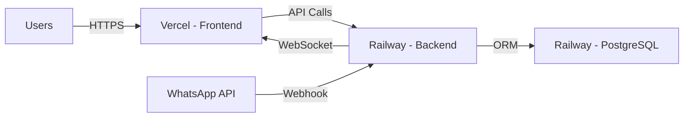

# Deploy to Vercel

Deploy your WhatsApp Team Inbox frontend to Vercel for optimal Next.js performance, automatic HTTPS, and global CDN.

## TL;DR - Quick Deploy

<Steps>
  <Step title="Import to Vercel">
    [Vercel](https://vercel.com) → New Project → Import GitHub repo → Root: `web`
  </Step>
  <Step title="Set Env Variables">
    Add `NEXT_PUBLIC_API_BASE_URL` (your backend URL) and `NEXT_PUBLIC_WS_URL`
  </Step>
  <Step title="Deploy">
    Click Deploy. Vercel builds and deploys with auto-HTTPS. Done! ✅
  </Step>
</Steps>

**Total time:** ~5 minutes | **Cost:** Free tier available

**Best paired with:** Railway backend (see [Railway guide](/deployment/railway))

---

## Overview

<Info>
Vercel is designed specifically for Next.js applications and provides the best performance for your frontend.
</Info>

<CardGroup cols={2}>
  <Card title="Next.js Optimized" icon="react">
    Built by the Next.js team for Next.js apps
  </Card>
  <Card title="Global CDN" icon="globe">
    Automatic edge deployment worldwide
  </Card>
  <Card title="Auto HTTPS" icon="lock">
    Free SSL certificates included
  </Card>
  <Card title="Free Tier" icon="gift">
    Generous free tier for personal projects
  </Card>
</CardGroup>

## Architecture

For a complete deployment, use Vercel for frontend + Railway for backend:



## Prerequisites

<Check>GitHub account</Check>
<Check>Vercel account (sign up at vercel.com)</Check>
<Check>Backend deployed (Railway, Heroku, or VPS)</Check>
<Check>Backend API URL available</Check>

## Quick Deploy

### Option 1: Deploy Button

[](https://vercel.com/new/clone?repository-url=https://github.com/your-org/whatsapp-team-inbox&root-directory=web)

### Option 2: Manual Deployment

<Steps>
  <Step title="Fork Repository">
    1. Go to [WhatsApp Team Inbox repository](https://github.com/your-org/whatsapp-team-inbox)
    2. Click **Fork** to create your copy
  </Step>

  <Step title="Import to Vercel">
    1. Log in to [Vercel](https://vercel.com)
    2. Click **Add New...** → **Project**
    3. Click **Import** next to your forked repository
  </Step>

  <Step title="Configure Project">
    **Framework Preset:** Next.js (auto-detected)

    **Root Directory:** `web`

    **Build Command:** `npm run build` (default)

    **Output Directory:** `.next` (default)

    **Install Command:** `npm install` (default)
  </Step>

  <Step title="Set Environment Variables">
    Add required environment variables:

    ```bash
    NEXT_PUBLIC_API_BASE_URL=https://your-backend.railway.app
    NEXT_PUBLIC_WS_URL=wss://your-backend.railway.app
    ```

    Click **Deploy**
  </Step>
</Steps>

## Environment Variables

Configure these in Vercel dashboard → Project → Settings → Environment Variables:

### Required Variables

<ParamField path="NEXT_PUBLIC_API_BASE_URL" type="string" required>
  Backend API URL

  **Example:** `https://api.your-domain.com` or `https://your-app.railway.app`

  **Note:** Must use HTTPS in production
</ParamField>

<ParamField path="NEXT_PUBLIC_WS_URL" type="string" required>
  WebSocket server URL

  **Example:** `wss://api.your-domain.com` or `wss://your-app.railway.app`

  **Note:** Must use WSS (secure WebSocket) in production
</ParamField>

### Optional Variables

<ParamField path="NEXT_PUBLIC_APP_ENV" type="string" default="production">
  Application environment

  **Options:** `production`, `staging`, `development`
</ParamField>

<ParamField path="NEXT_PUBLIC_ENABLE_ANALYTICS" type="boolean" default="false">
  Enable analytics tracking

  Set to `true` to enable built-in analytics
</ParamField>

### Environment-Specific Variables

Vercel supports different variables per environment:

<Tabs>
  <Tab title="Production">
    Used for production deployments (main branch)

    ```bash
    NEXT_PUBLIC_API_BASE_URL=https://api.your-domain.com
    NEXT_PUBLIC_WS_URL=wss://api.your-domain.com
    ```
  </Tab>

  <Tab title="Preview">
    Used for pull request previews

    ```bash
    NEXT_PUBLIC_API_BASE_URL=https://staging-api.your-domain.com
    NEXT_PUBLIC_WS_URL=wss://staging-api.your-domain.com
    ```
  </Tab>

  <Tab title="Development">
    Used for local development (vercel dev)

    ```bash
    NEXT_PUBLIC_API_BASE_URL=http://localhost:4000
    NEXT_PUBLIC_WS_URL=ws://localhost:4001
    ```
  </Tab>
</Tabs>

## Custom Domain

### Add Your Domain

<Steps>
  <Step title="Access Domain Settings">
    Project → **Settings** → **Domains**
  </Step>

  <Step title="Add Domain">
    Click **Add** and enter your domain:
    - `app.your-domain.com` (recommended for subdomain)
    - `your-domain.com` (for root domain)
  </Step>

  <Step title="Configure DNS">
    Add DNS records at your domain registrar:

    **For subdomain (app.your-domain.com):**
    ```
    Type: CNAME
    Name: app
    Value: cname.vercel-dns.com
    ```

    **For root domain (your-domain.com):**
    ```
    Type: A
    Name: @
    Value: 76.76.21.21
    ```
  </Step>

  <Step title="Verify Domain">
    Vercel will automatically verify your domain and issue SSL certificate

    Usually takes 1-5 minutes
  </Step>

  <Step title="Update Backend CORS">
    Update your backend's CORS_ORIGIN to include new domain:

    ```bash
    # In Railway/backend environment
    CORS_ORIGIN=https://app.your-domain.com
    ```
  </Step>
</Steps>

## Deployment Settings

### Build & Development Settings

Configure in Project → **Settings** → **General**:

<AccordionGroup>
  <Accordion title="Framework Preset">
    **Next.js** (auto-detected)

    Optimizes build for Next.js best practices
  </Accordion>

  <Accordion title="Root Directory">
    Set to `web` if your Next.js app is in a subdirectory

    Leave blank if Next.js is at repository root
  </Accordion>

  <Accordion title="Build Command">
    **Default:** `npm run build`

    **Custom:** Can override for monorepos or special cases
  </Accordion>

  <Accordion title="Output Directory">
    **Default:** `.next`

    **Note:** Don't change unless using custom Next.js config
  </Accordion>

  <Accordion title="Install Command">
    **Default:** `npm install`

    **Alternative:** Use `pnpm install` or `yarn install`
  </Accordion>
</AccordionGroup>

### Git Configuration

<Steps>
  <Step title="Set Production Branch">
    Settings → **Git** → **Production Branch**

    **Recommended:** `main` or `master`
  </Step>

  <Step title="Enable Auto-Deploy">
    ✅ **Deploy on Push** - Auto-deploy when you push to production branch
  </Step>

  <Step title="Configure Preview Deployments">
    ✅ **Preview Deployments** - Create preview for every pull request

    This allows testing changes before merging to main
  </Step>
</Steps>

## Preview Deployments

Vercel automatically creates preview deployments for every push and pull request:

### How Preview Works

<Steps>
  <Step title="Create Pull Request">
    ```bash
    git checkout -b feature/new-ui
    git push origin feature/new-ui
    ```
  </Step>

  <Step title="Automatic Deployment">
    Vercel automatically deploys your branch

    You'll get a unique preview URL:
    ```
    https://whatsapp-inbox-abc123.vercel.app
    ```
  </Step>

  <Step title="Test Changes">
    Test your changes in the preview environment

    Preview deployments have their own environment variables (set in Preview section)
  </Step>

  <Step title="Merge to Production">
    Once approved, merge to main branch:
    ```bash
    git checkout main
    git merge feature/new-ui
    git push origin main
    ```

    Production deployment automatically triggers
  </Step>
</Steps>

### Share Preview with Team

Every preview deployment gets a unique URL you can share:

1. Go to your project dashboard
2. Click on the preview deployment
3. Click **Visit** to open preview
4. Share URL with team for review

## Performance Optimization

### Next.js Configuration

Optimize your Next.js app for Vercel:

```js
// web/next.config.js
module.exports = {
  // Enable React Strict Mode
  reactStrictMode: true,

  // Optimize images
  images: {
    domains: ['your-backend-domain.com'],
    formats: ['image/avif', 'image/webp'],
  },

  // Compress output
  compress: true,

  // Enable SWC minification
  swcMinify: true,

  // Production source maps (for debugging)
  productionBrowserSourceMaps: true,
};
```

### Image Optimization

Use Next.js Image component for automatic optimization:

```jsx
import Image from 'next/image';

// Instead of:


// Use:
<Image
  src="/logo.png"
  alt="Logo"
  width={200}
  height={50}
  priority // For above-the-fold images
/>
```

### Bundle Analysis

Analyze your bundle size:

<Steps>
  <Step title="Install Analyzer">
    ```bash
    cd web
    npm install @next/bundle-analyzer
    ```
  </Step>

  <Step title="Update next.config.js">
    ```js
    const withBundleAnalyzer = require('@next/bundle-analyzer')({
      enabled: process.env.ANALYZE === 'true',
    });

    module.exports = withBundleAnalyzer({
      // ... other config
    });
    ```
  </Step>

  <Step title="Run Analysis">
    ```bash
    ANALYZE=true npm run build
    ```

    Opens interactive bundle size visualization
  </Step>
</Steps>

## Monitoring

### Analytics

Vercel provides built-in analytics:

<Steps>
  <Step title="Enable Analytics">
    Project → **Analytics** → **Enable**

    Free tier: 100k data points/month
  </Step>

  <Step title="View Metrics">
    Monitor:
    - Page views
    - Unique visitors
    - Top pages
    - Referrers
    - Countries
  </Step>
</Steps>

### Speed Insights

Monitor real user performance:

<Steps>
  <Step title="Enable Speed Insights">
    ```bash
    cd web
    npm install @vercel/speed-insights
    ```
  </Step>

  <Step title="Add to App">
    ```jsx
    // app/layout.tsx
    import { SpeedInsights } from '@vercel/speed-insights/next';

    export default function RootLayout({ children }) {
      return (
        <html>
          <body>
            {children}
            <SpeedInsights />
          </body>
        </html>
      );
    }
    ```
  </Step>

  <Step title="View Reports">
    Project → **Speed Insights**

    See Core Web Vitals scores
  </Step>
</Steps>

## Serverless Functions

Vercel supports Next.js API routes as serverless functions:

### Example API Route

```js
// web/pages/api/health.js
export default function handler(req, res) {
  res.status(200).json({
    status: 'ok',
    timestamp: new Date().toISOString()
  });
}
```

Deployed automatically at: `https://your-app.vercel.app/api/health`

### Function Configuration

```js
// web/pages/api/your-function.js
export const config = {
  runtime: 'edge', // Use edge runtime for lowest latency
  regions: ['iad1'], // Specify deployment region
  maxDuration: 10, // Max execution time (seconds)
};
```

## CI/CD Integration

### GitHub Integration

Vercel integrates seamlessly with GitHub:

<CardGroup cols={2}>
  <Card title="Automatic Deploys" icon="rocket">
    Every push to main triggers production deploy
  </Card>
  <Card title="PR Previews" icon="eye">
    Every pull request gets a preview deployment
  </Card>
  <Card title="Status Checks" icon="check">
    Build status shown in pull requests
  </Card>
  <Card title="Rollbacks" icon="rotate-left">
    One-click rollback to previous deployment
  </Card>
</CardGroup>

### Deployment Protection

Enable deployment protection for production:

<Steps>
  <Step title="Access Protection Settings">
    Settings → **Deployment Protection**
  </Step>

  <Step title="Configure Rules">
    - ✅ **Vercel Authentication** - Require login to view previews
    - ✅ **Password Protection** - Add password to previews
    - ✅ **Trusted IPs** - Whitelist IP addresses
  </Step>
</Steps>

## Troubleshooting

<AccordionGroup>
  <Accordion title="Build Failed">
    **Common causes:**
    - TypeScript errors
    - Missing environment variables
    - Build timeout

    **Solutions:**
    1. Check build logs in deployment details
    2. Fix TypeScript errors locally first
    3. Verify all NEXT_PUBLIC_ variables are set
    4. Contact support if timeout persists
  </Accordion>

  <Accordion title="Can't Connect to Backend">
    **Causes:**
    - NEXT_PUBLIC_API_BASE_URL incorrect
    - CORS not configured on backend
    - Backend not deployed

    **Solutions:**
    1. Verify NEXT_PUBLIC_API_BASE_URL uses HTTPS
    2. Check backend CORS_ORIGIN includes Vercel domain
    3. Test backend health endpoint directly
  </Accordion>

  <Accordion title="WebSocket Connection Failed">
    **Causes:**
    - Using WS instead of WSS
    - Backend WebSocket not accessible
    - Firewall blocking WebSocket

    **Solutions:**
    1. Ensure NEXT_PUBLIC_WS_URL uses `wss://` (not `ws://`)
    2. Test WebSocket endpoint with wscat
    3. Check backend WebSocket server is running
  </Accordion>

  <Accordion title="Environment Variables Not Working">
    **Causes:**
    - Variable name doesn't start with NEXT_PUBLIC_
    - Not redeployed after adding variables
    - Using wrong environment

    **Solutions:**
    1. Client-side variables must start with `NEXT_PUBLIC_`
    2. Redeploy after adding/changing variables
    3. Check you're using correct environment (Production/Preview/Development)
  </Accordion>
</AccordionGroup>

## Cost Optimization

### Free Tier Limits

<Info>
Vercel's free tier is generous and suitable for most small projects:
</Info>

- 100 GB bandwidth/month
- 100 deployments/day
- Unlimited preview deployments
- 6,000 build minutes/month
- Analytics (100k data points)

### Upgrade to Pro

Consider Pro plan ($20/month) when you need:

- More bandwidth (1 TB)
- Priority support
- Team collaboration
- Advanced analytics
- Password protection

## Production Checklist

<Check>Backend deployed and accessible</Check>
<Check>Environment variables configured</Check>
<Check>Custom domain added (optional)</Check>
<Check>SSL certificate active</Check>
<Check>CORS configured on backend</Check>
<Check>Analytics enabled</Check>
<Check>Error tracking set up</Check>
<Check>Performance monitoring enabled</Check>
<Check>Preview deployments tested</Check>

## Vercel + Railway Complete Setup

For a complete production setup:

<Steps>
  <Step title="Deploy Backend to Railway">
    Follow [Railway deployment guide](/deployment/railway)
  </Step>

  <Step title="Get Railway URLs">
    Copy backend and WebSocket URLs from Railway
  </Step>

  <Step title="Deploy Frontend to Vercel">
    Use Railway URLs in Vercel environment variables
  </Step>

  <Step title="Configure Custom Domains">
    - Frontend: app.your-domain.com (Vercel)
    - Backend: api.your-domain.com (Railway)
  </Step>

  <Step title="Update CORS">
    Set Railway backend CORS to Vercel domain
  </Step>
</Steps>

## Next Steps

<CardGroup cols={2}>
  <Card title="Railway Backend" icon="train" href="/deployment/railway">
    Deploy backend to Railway
  </Card>
  <Card title="Environment Variables" icon="gear" href="/deployment/environment-variables">
    Complete environment reference
  </Card>
  <Card title="Going Live" icon="globe" href="/deployment/going-live">
    Production deployment checklist
  </Card>
  <Card title="Performance" icon="gauge-high" href="/optimization/frontend">
    Optimize frontend performance
  </Card>
</CardGroup>

## Resources

- [Vercel Documentation](https://vercel.com/docs)
- [Next.js Documentation](https://nextjs.org/docs)
- [Vercel Community](https://github.com/vercel/vercel/discussions)
- [Vercel Status](https://www.vercel-status.com)
