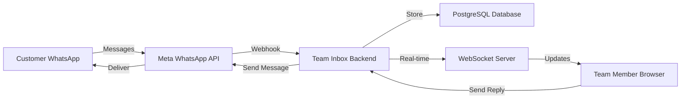
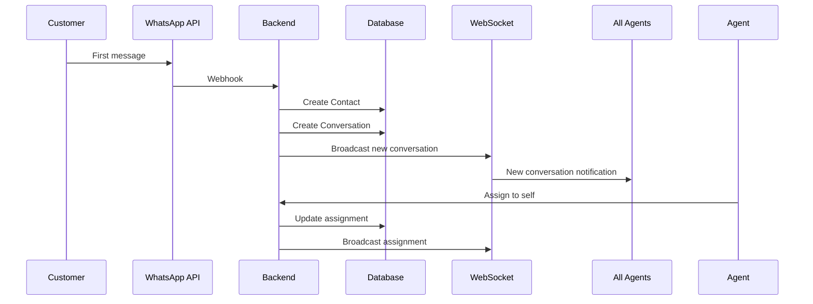
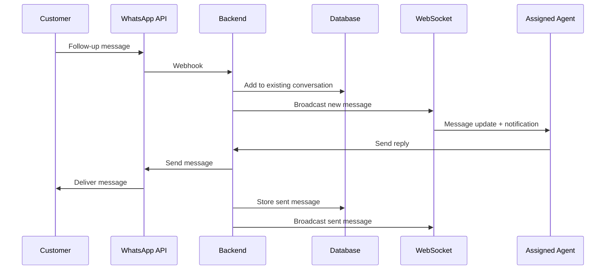

## System Overview

WhatsApp Team Inbox is a self-hosted application that connects your WhatsApp Business API account to a collaborative inbox interface for your team.

<Frame>
  
</Frame>

## High-Level Architecture



## How Messages Flow

### 1. Customer Sends Message

<Steps>
  <Step title="Customer Initiates">
    Customer sends WhatsApp message to your business number
  </Step>

  <Step title="Meta Receives">
    Meta WhatsApp Business API receives the message
  </Step>

  <Step title="Webhook Triggered">
    Meta sends webhook POST request to your Team Inbox backend
  </Step>

  <Step title="Message Stored">
    Backend validates, stores message in PostgreSQL database
  </Step>

  <Step title="Real-Time Update">
    WebSocket server broadcasts message to all connected team members
  </Step>

  <Step title="Team Notified">
    Team members see new message instantly + browser notification
  </Step>
</Steps>

### 2. Team Member Replies

<Steps>
  <Step title="Agent Types Reply">
    Team member types response in Team Inbox interface
  </Step>

  <Step title="API Request">
    Frontend sends message to backend API
  </Step>

  <Step title="Send to WhatsApp">
    Backend calls Meta WhatsApp API to send message
  </Step>

  <Step title="Store Locally">
    Backend stores sent message in database
  </Step>

  <Step title="Broadcast Update">
    WebSocket broadcasts sent message to all team members
  </Step>

  <Step title="Customer Receives">
    Customer receives message on their WhatsApp
  </Step>
</Steps>

## Core Components

### Frontend (Next.js)

<Card title="Web Application" icon="browser">
  **Technology**: Next.js 14, React, TypeScript, TailwindCSS

  **Responsibilities**:
  - Team inbox interface
  - Real-time message updates via WebSocket
  - Conversation management UI
  - Contact management
  - Team collaboration features
  - Push notification subscription
  - Multi-language support
</Card>

**Key Features**:
- **Server-Side Rendering** for fast initial page loads
- **WebSocket Connection** for real-time updates
- **Optimistic UI Updates** for snappy user experience
- **Service Worker** for push notifications when tab closed

### Backend (Express.js)

<Card title="API Server" icon="server">
  **Technology**: Express.js, TypeScript, Prisma ORM

  **Responsibilities**:
  - WhatsApp webhook handling
  - REST API for frontend
  - WebSocket server for real-time updates
  - Authentication & authorization
  - Push notification delivery
  - Email notifications
  - Business logic and validation
</Card>

**Key Endpoints**:
```
POST   /api/webhook/whatsapp    - Receive WhatsApp messages
GET    /api/conversations        - List conversations
GET    /api/conversations/:id    - Get conversation details
POST   /api/conversations/:id/messages - Send message
GET    /api/contacts             - List contacts
POST   /api/auth/login           - Team member login
```

### Database (PostgreSQL)

<Card title="Data Storage" icon="database">
  **Technology**: PostgreSQL with Prisma ORM

  **Stores**:
  - Conversations and messages
  - Contacts and profiles
  - Team members and authentication
  - Push notification subscriptions
  - System settings and configuration
</Card>

**Key Tables**:
- `User` - Team members with auth credentials
- `Contact` - Customer profiles and metadata
- `Conversation` - WhatsApp conversation threads
- `Message` - Individual messages (sent/received)
- `PushSubscription` - Browser push notification endpoints

### WhatsApp Business API

<Card title="Meta Cloud API" icon="whatsapp">
  **Provider**: Meta (Facebook)

  **Purpose**:
  - Official WhatsApp messaging for businesses
  - Send/receive messages
  - Media handling (images, documents, etc.)
  - Message status tracking
  - Conversation pricing
</Card>

## Real-Time Communication

### WebSocket Architecture

Team Inbox uses WebSocket for instant updates:

```typescript
// When message arrives
Backend receives webhook
  ↓
Stores in database
  ↓
Broadcasts via WebSocket to all connected clients
  ↓
All team members see update instantly (< 100ms)
```

**Events Broadcast**:
- New incoming messages
- New outgoing messages
- Conversation assignment changes
- Typing indicators
- Team member presence (online/offline)
- Message read receipts

### Push Notifications

When team members don't have the app open:

<Steps>
  <Step title="Browser Subscribes">
    Service Worker registers push notification subscription
  </Step>

  <Step title="Backend Stores">
    Backend stores subscription in database
  </Step>

  <Step title="Message Arrives">
    New WhatsApp message received
  </Step>

  <Step title="Push Sent">
    Backend sends push notification via Web Push API
  </Step>

  <Step title="Browser Shows">
    Browser displays notification even if tab closed
  </Step>

  <Step title="Click Opens">
    Clicking notification opens conversation in Team Inbox
  </Step>
</Steps>

## Conversation Workflow

### New Conversation



### Ongoing Conversation



## Security Flow

### Authentication

<Steps>
  <Step title="Login">
    Team member enters email + password
  </Step>

  <Step title="Verification">
    Backend verifies credentials against database
  </Step>

  <Step title="JWT Token">
    Backend generates JWT token with user ID and role
  </Step>

  <Step title="Store Token">
    Frontend stores token in localStorage
  </Step>

  <Step title="API Requests">
    All API requests include `Authorization: Bearer <token>` header
  </Step>

  <Step title="Validation">
    Backend validates JWT on every request
  </Step>
</Steps>

### WhatsApp Webhook Security

```typescript
// Webhook verification flow
1. Meta sends webhook with signature header
2. Backend computes HMAC with app secret
3. Compares computed signature with received signature
4. Only processes if signatures match
5. Prevents unauthorized webhook calls
```

## Data Flow Examples

### Sending a WhatsApp Message

```typescript
// 1. Frontend request
POST /api/conversations/123/messages
Body: { content: "Hello! How can I help?" }
Headers: { Authorization: "Bearer <jwt>" }

// 2. Backend processing
- Validates JWT token
- Checks user has access to conversation
- Calls WhatsApp API to send message
- Stores message in database
- Broadcasts via WebSocket

// 3. WhatsApp API
- Delivers message to customer
- Sends delivery receipt webhook
- Backend updates message status

// 4. All team members see message instantly
```

### Receiving a WhatsApp Message

```typescript
// 1. Meta webhook
POST /api/webhook/whatsapp
Body: {
  object: "whatsapp_business_account",
  entry: [{
    changes: [{
      value: {
        messages: [{
          from: "1234567890",
          text: { body: "I need help" }
        }]
      }
    }]
  }]
}

// 2. Backend processing
- Verifies webhook signature
- Extracts message data
- Finds or creates contact
- Finds or creates conversation
- Stores message
- Broadcasts to WebSocket clients

// 3. Frontend receives
- WebSocket event triggers
- Conversation list updates
- Notification shown
- Unread count increments
```

## Deployment Architecture

### Single Server Deployment (Small Teams)

```
┌─────────────────────────────────┐
│     Cloud Server (Railway)      │
│                                 │
│  ┌─────────┐  ┌──────────┐    │
│  │ Backend │  │ Frontend │    │
│  │ Node.js │  │ Next.js  │    │
│  └─────────┘  └──────────┘    │
└─────────────────────────────────┘
         ↓
┌─────────────────────────────────┐
│   Managed PostgreSQL Database   │
└─────────────────────────────────┘
```

### Scalable Deployment (Growing Teams)

```
┌────────────┐     ┌────────────┐
│  Frontend  │     │  Frontend  │
│  (Vercel)  │     │  (Vercel)  │
└────────────┘     └────────────┘
         ↓                ↓
    ┌──────────────────────────┐
    │    Load Balancer (AWS)   │
    └──────────────────────────┘
         ↓                ↓
┌────────────┐     ┌────────────┐
│  Backend   │     │  Backend   │
│  Instance  │     │  Instance  │
└────────────┘     └────────────┘
         ↓                ↓
    ┌──────────────────────────┐
    │  PostgreSQL (AWS RDS)    │
    └──────────────────────────┘
```

## What Makes It Fast

<CardGroup cols={2}>
  <Card title="WebSocket Real-Time" icon="bolt">
    Sub-100ms message delivery using persistent connections
  </Card>

  <Card title="Optimistic Updates" icon="forward">
    UI updates immediately before server confirmation
  </Card>

  <Card title="Database Indexing" icon="database">
    Optimized queries with proper indexes on conversations
  </Card>

  <Card title="Next.js SSR" icon="gauge">
    Server-side rendering for instant page loads
  </Card>
</CardGroup>

## Monitoring & Observability

<Info>
  Built-in logging and monitoring help you track system health
</Info>

**What Gets Logged**:
- All WhatsApp webhook events
- API request/response times
- Database query performance
- WebSocket connection events
- Push notification delivery
- Error stack traces

**Recommended Monitoring**:
- Set up alerts for failed webhooks
- Monitor database connection pool
- Track API response times
- Watch error rates in logs

## Next Steps

<CardGroup cols={2}>
  <Card
    title="Deploy Your Instance"
    icon="rocket"
    href="/getting-started/deploy-in-30-minutes"
  >
    Get Team Inbox running in 30 minutes
  </Card>

  <Card
    title="Technical Architecture"
    icon="diagram-project"
    href="/deployment/introduction"
  >
    Deep dive into deployment architecture
  </Card>
</CardGroup>
